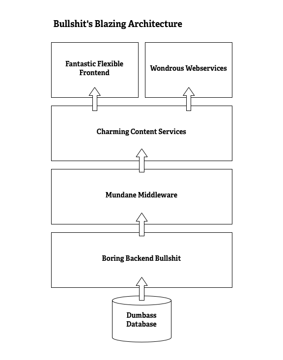

bullshit-framework
==================

Bullshit is the industry leading framework for web development. Everyone is using it!

Questions (and Answers)
-----------------------

Q: Why use Bullshit?

A: Thanks to Bullshit's amazing, almost completely fabricated capabilities, you'll be able to build applications faster, swiftly, quicker and with alacrity. Our BSDD (bullshit-driven design) methodology is the leading way to get things done in the industry. Who's using it? Everybody!

Q: Who's using Bullshit?

A: Who isn't! I mean, come on, look at all the pull requests we've already had!

Q: How long has Bullshit been around?

A: Bullshit is very mature. Some say it's as old as time.

Q: How does Bullshit work?

A: No one really knows. Some say that it's magic. Personally, I think it's a gift from an alien civilization.

Deploying Bullshit
------------------

BTW, you can now deploy Bullshit with Shovel, the new cloud-friendly deployment tool. It's part of our new Bullshit-as-a-Service offering.